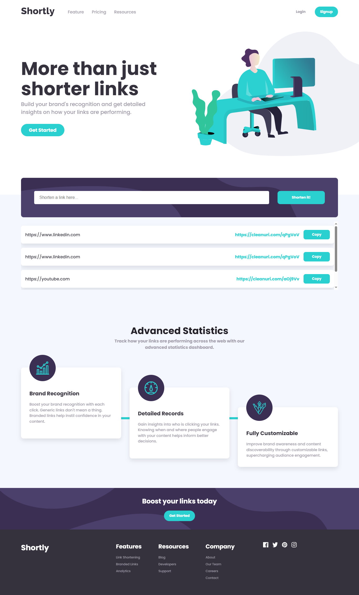

# Frontend Mentor - Shortly URL shortening API Challenge solution

This is a solution to the [Shortly URL shortening API Challenge challenge on Frontend Mentor](https://www.frontendmentor.io/challenges/url-shortening-api-landing-page-2ce3ob-G). Frontend Mentor challenges help you improve your coding skills by building realistic projects. 

## Table of contents

- [Overview](#overview)
  - [The challenge](#the-challenge)
  - [Screenshot](#screenshot)
  - [Links](#links)
- [My process](#my-process)
  - [Built with](#built-with)
  - [What I learned](#what-i-learned)
  - [Continued development](#continued-development)
  - [Useful resources](#useful-resources)
- [Author](#author)
- [Acknowledgments](#acknowledgments)

## Overview

### The challenge

Users should be able to:

- View the optimal layout for the site depending on their device's screen size
- Shorten any valid URL
- See a list of their shortened links, even after refreshing the browser
- Copy the shortened link to their clipboard in a single click
- Receive an error message when the `form` is submitted if:
  - The `input` field is empty

### Screenshot




### Links

- Solution URL: [GITHUB](https://github.com/abdisavia/url-shortening-api)
- Live Site URL: [Shortly](https://url-shortening-api-sandy-alpha.vercel.app/)

## My process

### Built with

- Semantic HTML5 markup
- [CSS Modules](https://nextjs.org/docs/13/pages/building-your-application/styling/css-modules) - for easier css management
- Flexbox
- CSS Grid
- Mobile-first workflow
- [React](https://reactjs.org/) - JS library
- [Next.js](https://nextjs.org/) - React framework


### What I learned

In this challenge, I relearned how to implement a responsive user interface and also how to use fetchapi to send requests and receive responses from the server. using Cookies to store the history of shortened URLs. Below is the code for how I store the history of shortened URLs.

```js
import { cookies } from "next/headers";
import { redirect, RedirectType } from "next/navigation";

export async function POST(request) {
    try {
        let { url } = await request.json();
        const formdata = new FormData();
        formdata.append("url", url);

        const result = await fetch("https://cleanuri.com/api/v1/shorten", {
            method: "POST",
            body: formdata,
        });

        const data = await result.json();

        if (data?.result_url) {
           await saveToCookies(url, data.result_url);
        }
        return Response.json({data}, { status: 200 })
    } catch (error) {
        return Response.json({ "error": error }, {status:500})
    }
}

export async function GET() {
    try {
        const cookie = await cookies();
        const shortListString = cookie.get("shortenedList")?.value;
        
        let shortList = [];
        if (shortListString) {
            shortList = JSON.parse(shortListString);
        }
        
        return Response.json({ data: shortList },{ status: 200 })


    } catch (error) {
        return Response.json({ "error": error }, { status: 500 });
    }
}

async function saveToCookies(url_plain, url_short) {
    try {
        
        const cookieStore = await cookies();

        let currentList = [];
        if (cookieStore.has("shortenedList")) {
            const shortListString = cookieStore.get("shortenedList")?.value;
            if (shortListString) {
                currentList = JSON.parse(shortListString);
            }
        }

        currentList.push({
            "url_plain": url_plain,
            "url_short": url_short
        });

        cookieStore.set({
            name: "shortenedList",
            value: JSON.stringify(currentList),
            maxAge: 60 * 60 * 24 * 7,
        })

    } catch (error) {
        console.log(error);
    }
}
```

In short, I made a request to the cleanuri API after confirming that the results did not contain any errors. Next, the shortened URL results will be stored in cookies in the form of an array, so that they can be displayed again later. 

Using cookies to store history is a bit tricky compared to using LocalStorage. But at least I managed to use cookies to store the history of shortened URLs.

### Continued development

Using other libraries and frameworks.

### Useful resources

- [NextJS](https://nextjs.org/docs)

## Author

- Frontend Mentor - [@Hyeronemus Abdi Sang Savia](https://www.frontendmentor.io/profile/abdisavia)
- Github - [@abdisavia](https://github.com/abdisavia)
- LinkedIn - [@Hyeronemus Abdi Sang Savia](www.linkedin.com/in/hyeronemus-abdi-sang-savia-522538221)

## Acknowledgments

